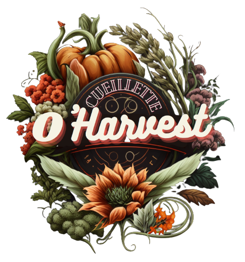

# O'HARVEST (Front)

---

### set and launch local version

In order to install dependencies and launch local server:
```
# with npm 
npm i
npm run dev

# with yarn
yarn
yarn dev
```


## Responsive format

---

#### Mobile widht: 320px - 425px

```
@media only screen and (max-width: 425px) {

}
```

#### Tablet width: 425px - 1024px

```
@media only screen and (min-width: 425px) {

}
```

#### Desktop widht: 1024px - 1440px

```
@media only screen and (min-width: 1024px) {

}
```

## Working flow on a new feature

---
Be placed on `dev` branch and update your branch:
```
git checkout dev
git pull origin dev
```

Create a new branch to work on a new feature :
```
git checkout -b feat/feature-name>
```

### (!) Naming branch convention
❌ ~~CamelCase ou pascalCase~~
✅ **kebab-case**


### (!) Naming commit convention:

- `config:` When configuration is changed
- `feat:` When adding new feature or new styles
- `fix:` When bug is resolved
- `doc:` When documentation is update
- `refacto:` When refactoring
- `style:` pour tous ce qui concerne le style
- `merge:` pour les merges et résolution de conflit
- `prod:` pour les mises en production (merge de dev dans main)
- `hotfix:` pour résoudre un bug sur main


Then explain in a few words the work done (mention the components/files on which you worked).
 ---

Once the development is finished and committed, we recover any modifications:

```
git pull origin feat/<name-feature>
```
For branch name:
❌ ~~CamelCase ou pascalCase~~
✅ **snake_case**

We resolve conflicts.

Once the conflicts are resolved, we make a pull request on **GitHub**, from the `feat/<feature-name>` branch in the `dev` branch.

Once the features have been collected in the `dev` branch and the bugs fixed,
we make a pull request on **GitHub**, from the `dev` branch in the `prod` branch.
